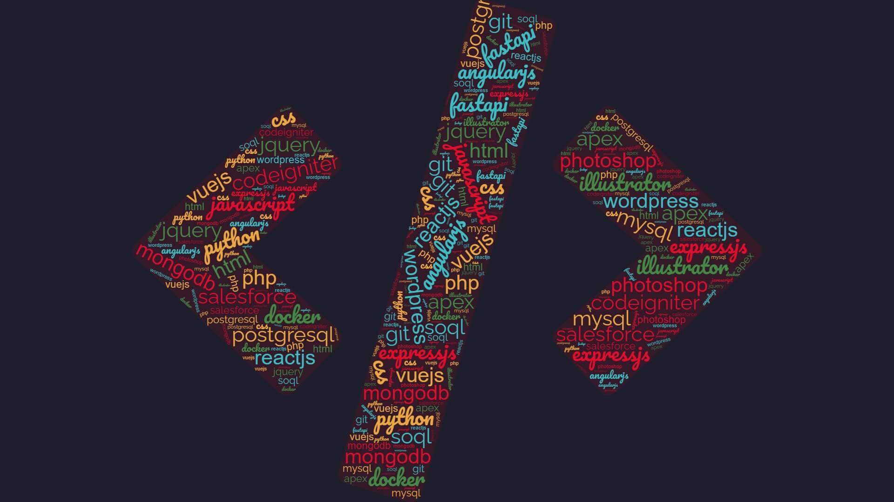

### Hello World 👋 This is Mahmud 
I am a full stack developer who builds stuff on the web with Python, PHP and JavaScript. Currently working as a Salesforce ☁️ developer and looking to collaborate in Rust

---
### 📝 Recent Blogposts:
<!-- BLOG-POST-LIST:START -->
- [Take your Windows PowerShell to the next level by Starship](https://dev.to/ganmahmud/take-your-windows-powershell-to-the-next-level-by-starship-2gb2)
- [A "Brave" way to brows blocked content from terminal](https://dev.to/ganmahmud/a-brave-way-to-brows-blocked-content-from-terminal-4k78)
<!-- BLOG-POST-LIST:END -->

<!--
**ganmahmud/ganmahmud** is a ✨ _special_ ✨ repository because its `README.md` (this file) appears on your GitHub profile.

Here are some ideas to get you started:

- 🔭 I’m currently working on ...
- 🌱 I’m currently learning ...
- 👯 I’m looking to collaborate on ...
- 🤔 I’m looking for help with ...
- 💬 Ask me about ...
- 📫 How to reach me: ...
- 😄 Pronouns: ...
- ⚡ Fun fact: ...
-->
